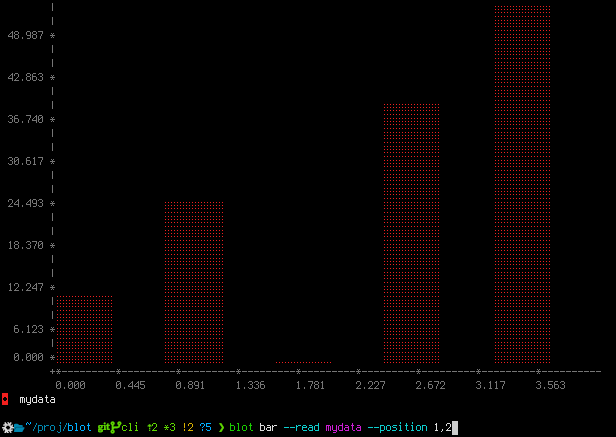
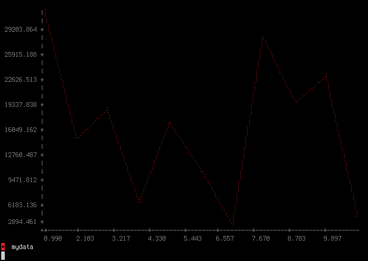
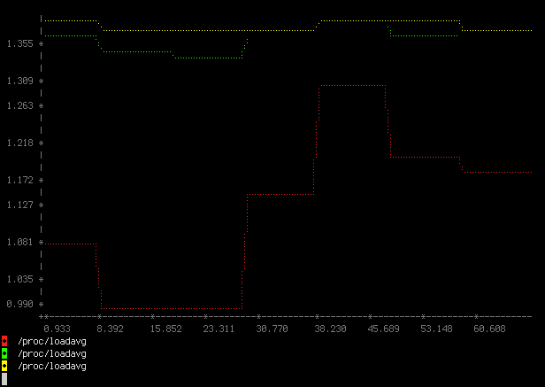
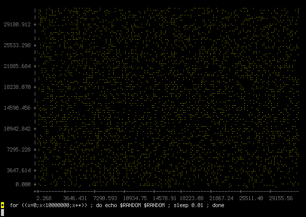
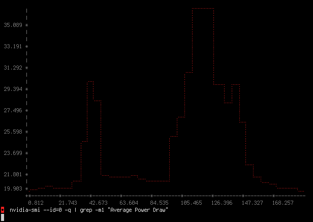
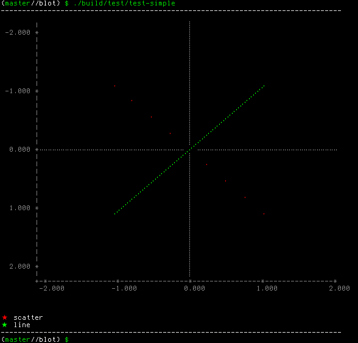
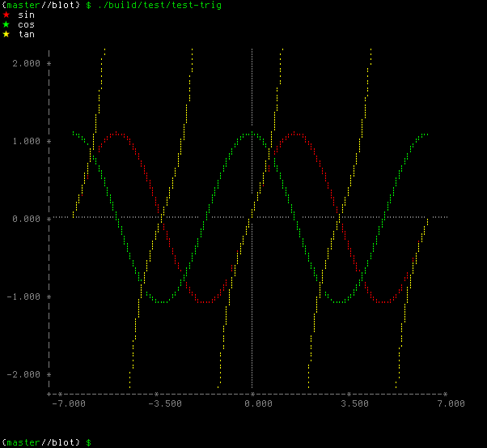

# blot

Blot is a plotting library written in C, that plots data onto a string buffer.

That's right, there are no images, just text -- see examples below.

There is a C++ wrapper provided, as well as a CLI tool.

Site: [bartman.github.io/blot](https://bartman.github.io/blot/)

GitHub: [github.com/bartman/blot](https://github.com/bartman/blot/)

Copyright © 2021-2025 Bart Trojanowski

Licensed under LGPL v2.1, or any later version.


## Noteworthy features

  * plots to the console as text (by calling `puts()`/`printf()`)
  * very very fast (compared to python alternatives)
  * very very memory usage friendly
  * can plot multiple datasets on one canvas
  * uses familiar figure based API (similar to existing python plotting frameworks)
  * supports braille plotting (like [plotille](https://github.com/tammoippen/plotille))
  * data arrays can be provided in various types (`int16`, `int32`, `int64`, `double`, or `float`)
  * there is a C++ wrapper, with limited features, for convenience
  * there is a CLI tool that can plot from files or using output of commands

## Prerequisites

`blot` is developed on NixOS and Debian, and CI tested on Debian and Ubuntu.
It is built using standard tools. The dependency script will install the
required packages if you're on a Debian-based distro.

    ./dependencies.sh

Packages that `blot` needs: `make` `ninja` `cmake` `glib2` `googletest`.

## Building

`blot` is built using `cmake` and `ninja`.  There is a top level `Makefile` only to
simplify the build process (it invokes `cmake` in the `build` subdirectory).

    make

You can build debug (with `ASAN`) using

    make TYPE=Debug

Run `make help` for a full list.

## blot CLI

The easiest say to use `blot` is to use the CLI, which is able to read from files
or launch programs, then plot the numbers it finds.

See the online help for a full list of features...
<details>
<summary> ❯ blot --help </summary>

```sh
SYNOPSIS
    blot [-h] [-V]
    blot [-v] [--debug] [--timing] [-i <sec>] [-A|-U|-B] ((scatter|line|bar)
         ([-R <file>] | [-F <file>] | [-P <file>] | [-X <cmd>] | [-W <cmd>])
         [-p <y-pos|x-pos,y-pos>] [-r <regex>] [-l <count>] [-c <color>] [-i <sec>])...

OPTIONS
    -h, --help                  This help
    -V, --version               Version

    Run modifiers:
        -v, --verbose           Enable verbose output
        --debug                 Enable debug output
        --timing                Show timing statitiscs
        -i, --interval <sec>    Display interval in seconds

    Output:
        -A, --ascii             ASCII output
        -U, --unicode           Unicode output
        -B, --braille           Braille output

    Plot type:
        scatter                 Add a scatter plot
        line                    Add a line/curve plot
        bar                     Add a bar plot

    Plot data source:
        -R, --read <file>       Read file to the end, each line is a record
        -F, --follow <file>     Read file waiting for more, each line is a record
        -P, --poll <file>       Read file at interval, each read is one record
        -X, --exec <cmd>        Run command, each line is a record
        -W, --watch <cmd>       Run command at interval, each read is one record

    Data source parsing:
        -p, --position <y-pos|x-pos,y-pos>
                                Find numbers in input line, pick 1 or 2 positions for X and Y values

        -r, --regex <regex>     Regex to match numbers from input line
        -l, --limit <count>     How many historical values to retain for plotting

    Plot modifiers:
        -c, --color <color>     Set plot color (1..255)
        -i, --interval <sec>    Set sampling interval in seconds

EXAMPLES

    blot --braille \
        line    --color 10 --read x_y1_values -p 1,2 \
        scatter --color 11 --read x_y2_values -p 1,2

    blot --braille \
        scatter --color 11 --read y_values \
        line    --color 10 --exec 'seq 1 100'

    blot --braille \
        line --poll /proc/loadavg --position 1 \
        line --poll /proc/loadavg --position 2 \
        line --poll /proc/loadavg --position 3
```
</details>

First, pick a plotting mode, there are 3 choices: `scatter`, `line`, and `bar`.
Multiple plots can be overlayed.

Each plot needs to get data from a file or process, and there are 5 options:
- `--read <file>` to read lines data from a file, stop at the end.
- `--follow <file>` to read lines data from a file, but wait for more data (`Ctrl-C` to stop).
- `--poll <file>` to poll a file (like `/sys` or `/proc` files), at some interval, and plot the results.
- `--exec <cmd>` to run a program that will give us data to plot on successive lines.
- `--watch <cmd>` to run a program that outputs one number per execution, which will be accumulate and plotted.

Let's look at some examples.

### plot numbers from a file (read file mode)

Let's say we have a file that contains some X,Y pairs...
```
0 10
1 25
2 0
3 40
4 55
```

We can plot this using...

```sh
❯ blot bar --read mydata --position 1,2
```
The values 1 and 2 are positions in each line where `blot` will find the X,Y coordinates.



### plot numbers from a log file (follow file mode)

Let's say that we have a log file, with some magnitude values.
Let's just make something up with a script...
```sh
#!/usr/bin/env bash
while true ; do
    echo $RANDOM
    sleep 1
done > mydata
```
While the above is running, we can plot the data being generated...
```sh
❯ blot line --follow mydata
```
The file contains only one number per line, and `blot` will use the line number as the Y coordinate.


Plot will update continuously, until `Ctrl-C` is used to stop.

### plot the system load (poll file mode)

Recall that `/proc/loadavg` has 3 load values (1,5,15 minutes).  We can plot them...

```sh
❯ blot line --poll /proc/loadavg --position 1 --interval 0.5 \
       line --poll /proc/loadavg --position 2 \
       line --poll /proc/loadavg --position 3
```


### read X,Y from command line (exec mode)

Here is a cool way to test your random number generator, generate two consecutive numbers and plot them against one another.

```sh
❯ blot scatter --exec 'for ((x=0;x<10000000;x++)) ; do echo $RANDOM $RANDOM ; done' --position 1,2
```


### plot power draw of a GPU (watch mode)

The Nvidia graphics tools provide a system management interface CLI, named `nvidia-smi`.
If we wanted to plot the average power draw, then we could do this...

```sh
blot --timing line --watch 'nvidia-smi --id=0 -q | grep -m1 "Average Power Draw"' --interval 0.1
```


## Source code examples

`blot` is being used in other projects as a library, and it comes with many
examples for the C and C++ usage.

Generated from [simple.c](examples/c/c-simple.c) (see also [simple.cpp](examples/cpp/cpp-simple.cpp) for C++ wrapper usage)

    ./build/examples/c/c-simple



Generated from [trig.c](examples/c/c-trig.c) (see also [trig.cpp](examples/cpp/cpp-trig.cpp) for C++ wrapper usage)

    ./build/examples/c/c-trig




## Missing features

  * different plotting modes like histograms (currently only plots line/scatter/bar)
  * improve axis line and numbering (currently not very accurate)
  * add axis labels and minor ticks (configurable)
  * draw origin lines and minor tick lines (configurable)
  * better 256 colour support

### Ideas:

Allow for swapping data from layer to allow for even faster plotting (allow `blot` to reuse existing allocated structures)
  1. create a figure
  2. all `blot_figure_scatter` multiple times, have it return the `blot_layer`
  3. call `blot_figure_render` and `blot_screen_get_text`
  4. then use `blot_layer_new_data` to swap the data
  5. repeat from step (3)

## Similar projects

  * [plotille](https://github.com/tammoippen/plotille) - Python, "plot, scatter plots and histograms in the terminal using braille dots"
  * [Tables-and-Graphs](https://github.com/tdulcet/Tables-and-Graphs) - "C++ Console Table and Graph/Plot Libraries"

