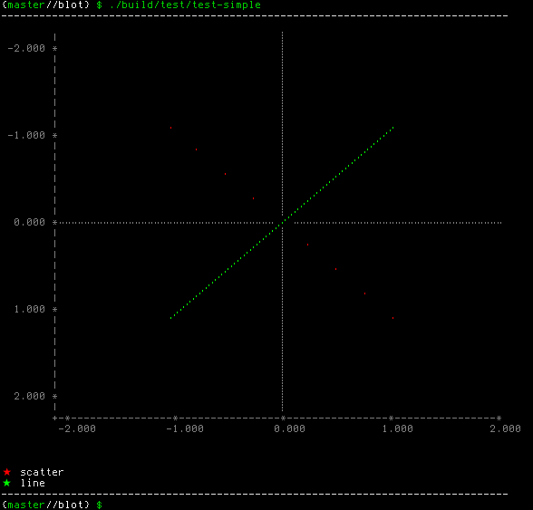
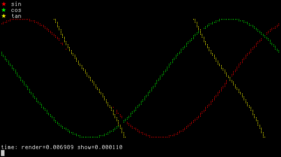

# blot

Blot is a plotting library written in C, that plots data onto a string buffer.

That's right, there are no images, just text -- see examples below.

Site: [bartman.github.io/blot](https://bartman.github.io/blot/)

GitHub: [github.com/bartman/blot](https://github.com/bartman/blot/)

Copyright © 2021 Bart Trojanowski

Licensed under LGPL v2.1, or any later version.

## Noteworthy features

  * plots to the console as text (by calling `printf()`)
  * very very fast (compared to python alternatives)
  * very very memory usage friendly
  * can plot multiple datasets on one canvas
  * uses familiar figure based API (similar to existing python plotting frameworks)
  * supports braille plotting (like [plotille](https://github.com/tammoippen/plotille))
  * 256 colour support
  * data arrays can be provided in various types (`int16`, `int32`, `int64`, `double`, or `float`)

## Prerequisites

blot was only tested on Debian Linux. It is built using standard tools.

    sudo apt install make ninja-build cmake libglib2.0-dev

## Building

blot is built using cmake and ninja.  There is a top level Makefile only to
simplify the build process (it invokes cmake in the `build` subdirectory).

    make

## Examples

blot is being used in other projects as a library, but it comes with some
examples.

Generated from [test-simple.c](test/test-simple.c)

    ./build/test/test-simple

Generated from [test-trig.c](test/test-trig.c)

    ./build/test/test-trig

## Missing features

  * different plotting modes like bar and histograms (currently only plots line/scatter)
  * improve axis line and numbering (currently not very accurate)
  * add axis labels and minor ticks (configurable)
  * draw origin lines and minor tick lines (configurable)

### Ideas:

Allow for swapping data from layer to allow for even faster plotting (allow blot to reuse existing allocated structures)
  1. create a figure
  2. all `blot_figure_scatter` multiple times, have it return the `blot_layer`
  3. call `blot_figure_render` and `blot_screen_get_text`
  4. then use `blot_layer_new_data` to swap the data
  5. repeat from step (3)

## Similar projects

  * [plotille](https://github.com/tammoippen/plotille) - Python, "plot, scatter plots and histograms in the terminal using braille dots"
  * [Tables-and-Graphs](https://github.com/tdulcet/Tables-and-Graphs) - "C++ Console Table and Graph/Plot Libraries"

